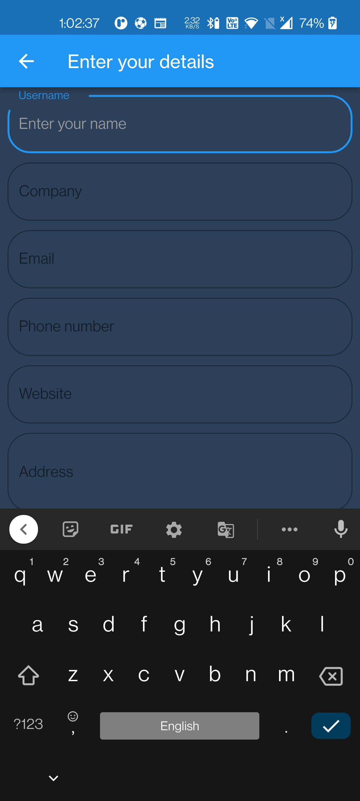

# Invoicer - Managing invoices made easy

An application built entirely in flutter for managing invoices. Personally the inspiration for this project was the fact that one of my friends
had to put in a lot of effort to generate a simple fixed kind of pdf for his clients and thus this project came up

## Features
- Add custom Terms and Conditions
- Add custom Services and Products (only Rs supported as the currency for the price)
- Generate Invoice from the entered details in pdf format
- Generate Receipt from the entered details in pdf format, Account Management [WIP]
- Generate an Estimate from the entered details in pdf format
- Focus on building a good UI as well as UX

## Lessons/Concepts Learnt
- How to generate a pdf in flutter, in a specific format and template
- How to work with Databases (SQL)
- Learning to draw Custom Curves
- How to take signature input from user by making him draw it
- How to pick files from the storage for both the platforms (Android and IOS)
- Bits of sound null-safety
- Working with asynchronous dart, involved in database operations

## Works with

Dart - 2.14.2 null-safety enabled

Flutter - 2.5.1

## Screenshots

### Android

  
  
  

